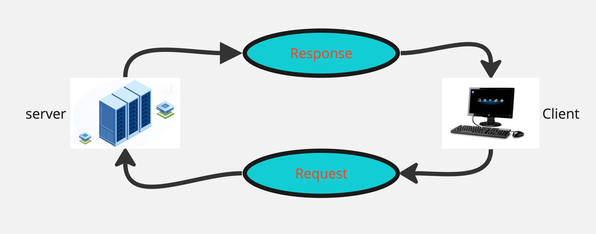

# Movies-Library - V.1.1

## Author Name : Mustafa Alhinity

this website is created to help organize movie library with previewing its poster , Review rate, comments 

## WRRC
**Image of WRRC** :

## Overview
this lab introduced me to the back end and to express library and how to access it ,Also i initialized package json and got access to it throgh my code.
Error codes were defined to me and how to use them wth meaning of each of them and how to test the server

## Getting Started - Steps
<!-- What are the steps that a user must take in order to build this app on their own machine and get it running? -->
1-defining express library 
2-initializing a new json data file 
3-getting conneted to a port throgh function handler
4-write codes for reading whats inside Json files